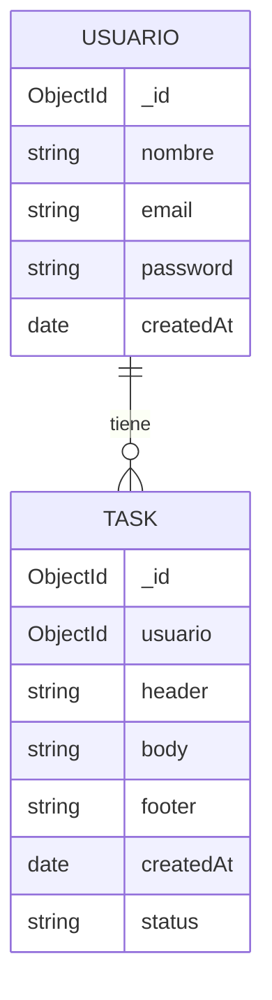

# 📋 Tasks App

> _Tu cuaderno digital de tareas, simple y personal._

Una aplicacion web para el seguimiento de tareas del dia a dia. Pensada para uso personal, sin distracciones, sin publicidad, sin cuentas obligatorias. Solo vos y tus pendientes.

---

## 🚀 Como empezar

```bash
pnpm install
pnpm dev
```

La aplicacion se levanta en `http://localhost:5173` y recarga automaticamente con cada cambio.

---

## 🧱 Stack MERN

| Tecnologia  | Rol                  |
| ----------- | -------------------- |
| **M**ongoDB | Base de datos        |
| **E**xpress | Backend / API REST   |
| **R**eact   | Frontend             |
| **N**ode.js | Entorno de ejecucion |

### Otras herramientas

| Herramienta  | Uso                  |
| ------------ | -------------------- |
| TypeScript   | Tipado estatico      |
| Vite         | Bundler y dev server |
| Tailwind CSS | Estilos utilitarios  |
| pnpm         | Gestor de paquetes   |

---

## 🗄️ Diagrama de la base de datos

### Colecciones



### Detalle de campos - `Task`

| Campo       | Tipo       | Descripcion                             |
| ----------- | ---------- | --------------------------------------- |
| `_id`       | `ObjectId` | Identificador unico                     |
| `usuario`   | `ObjectId` | Referencia al usuario dueno             |
| `header`    | `string`   | Titulo o encabezado de la tarea         |
| `body`      | `string`   | Descripcion o contenido                 |
| `footer`    | `string`   | Nota o pie adicional                    |
| `createdAt` | `date`     | Fecha de creacion                       |
| `status`    | `enum`     | `Pendiente` / `Atendida` / `Finalizada` |

---

## 📁 Estructura del frontend

```
src/
├── Assets/        # Imagenes, iconos, recursos estaticos
├── Components/    # Componentes reutilizables (botones, modales, etc.)
├── Page/          # Vistas de la aplicacion (Login, Dashboard, etc.)
└── ...            # Configuracion, estilos globales, entry point
```

---

Hecho con ❤️ para uso personal.
